# WordLadder-RESTful

**Note: the newest part(TASK III) is at the end of this md file**

[***Click here to jump to the TASK III***](#anchor)

This repo is for HW3 of SE418, which is a converted version of WordLadder-JAVA

## Requirements

1. Convert HW1 of SE418 to a RESTful service, using Java, Unit test, Github and Maven/Gradle.

2. Phase I: Spring Boot / Git workflow
8081
3. Phase II: Spring Actuator / *Spring Security

## Phase I

~~Now Phase I is under implementing, which is now store in branch `convert`.~~

Now the Phase I has been merged to master.

To run it, do as follows:

First, clone or download this repo:

```powershell
git clone https://github.com/sebastianj1w/WordLadder-RESTful.git
```

After clone or unzip, run the project by

```powershell
./mvnw spring-boot:run
```

## Phase II

### Spring actuator

Spring actuator adds several production grade services to the application with little effort on your part.

Now the Actuator has been added to the application.

By sending GET requests, we can get information abort the application:
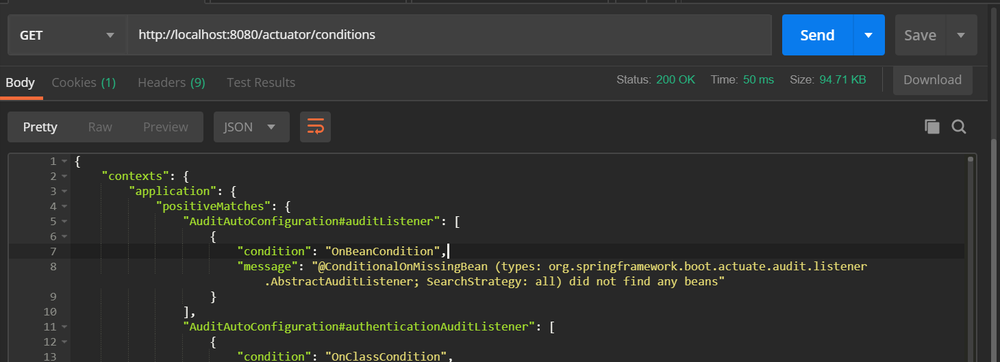

### Spring security

Now the application is under the protection of Spring Security. Actuator apis need to be authorizied.

Firstly, we try to get conditions by GET, but **the request is denied**.
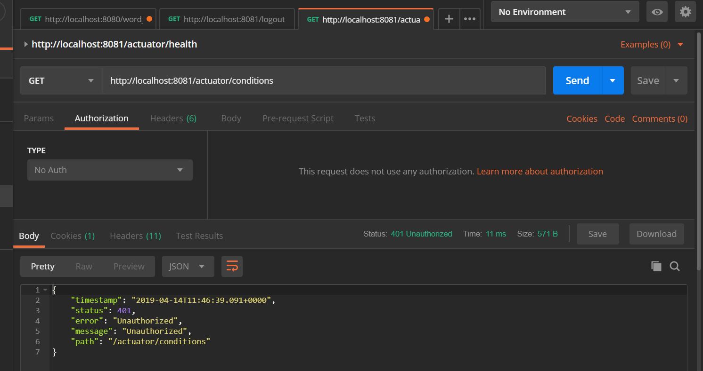

Then, we send a POST request containing login information. (note: To avoid CSRF issues, I disabled csrf protection)
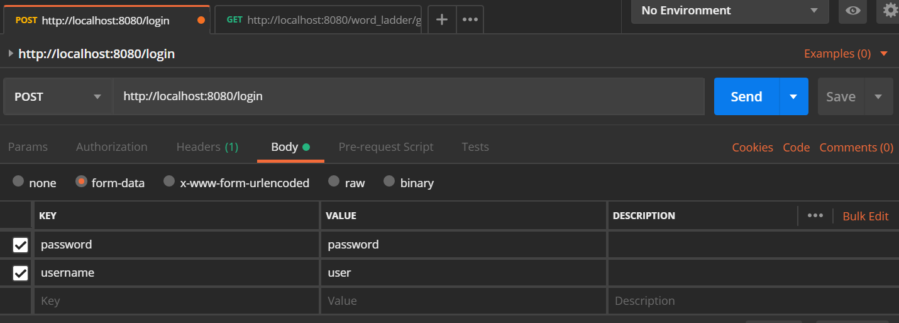
Or we can set the authorization to `Basic Auth`, and set the username and password.'
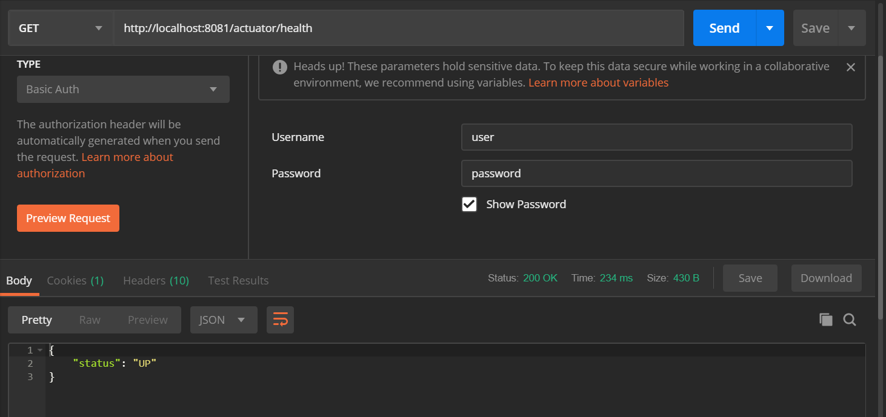

After sending the login informations, try again, and this time we succeded.
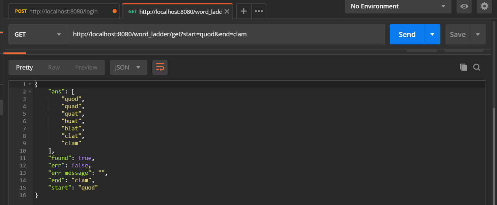

To logout, just sending a GET request, whose path is `/logout`
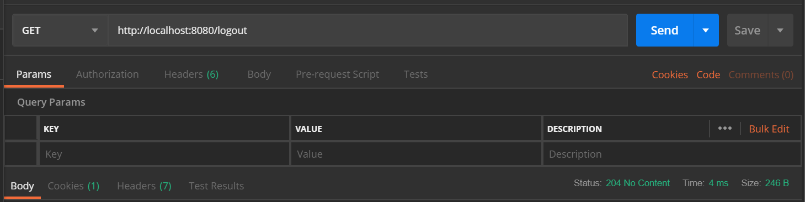

## Unit Test

~~Unit tests have been added to the `test` branch.~~

Now it has been merged into master, stored in `test` floder


## Performance

I used `JMeter`, `Prometheus` and `Visual VM` to mesure the resource comsumption of my application.

Firstly, run the application and tools, here is the initial status of things.

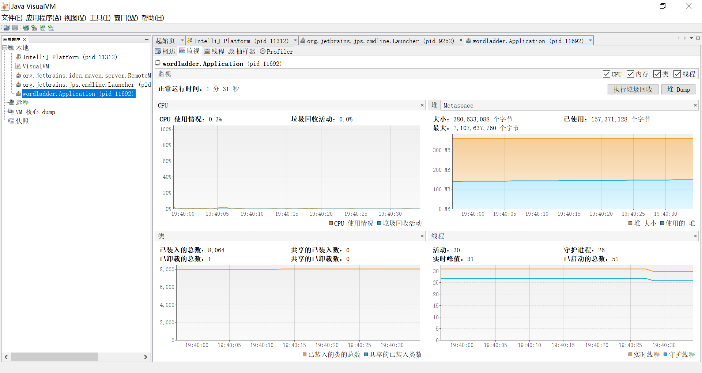
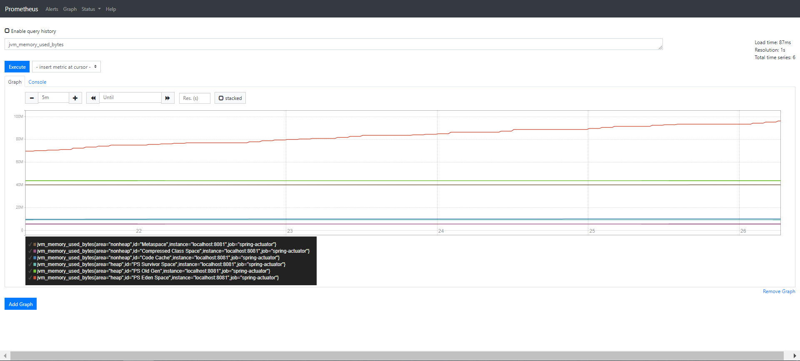
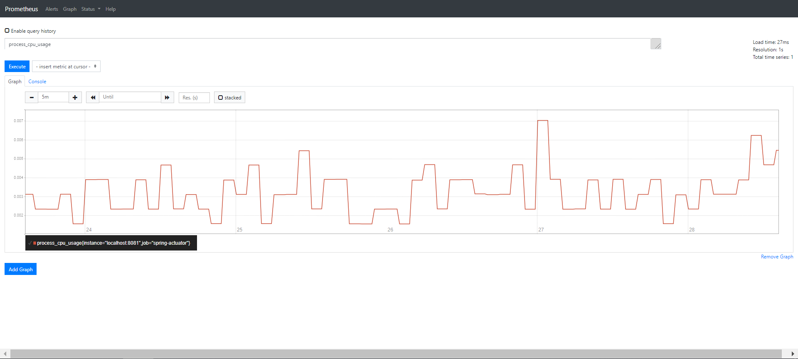

We can see that the resource comsumption is in a low rate because there is no requests.

Then, send requests by JMeter:
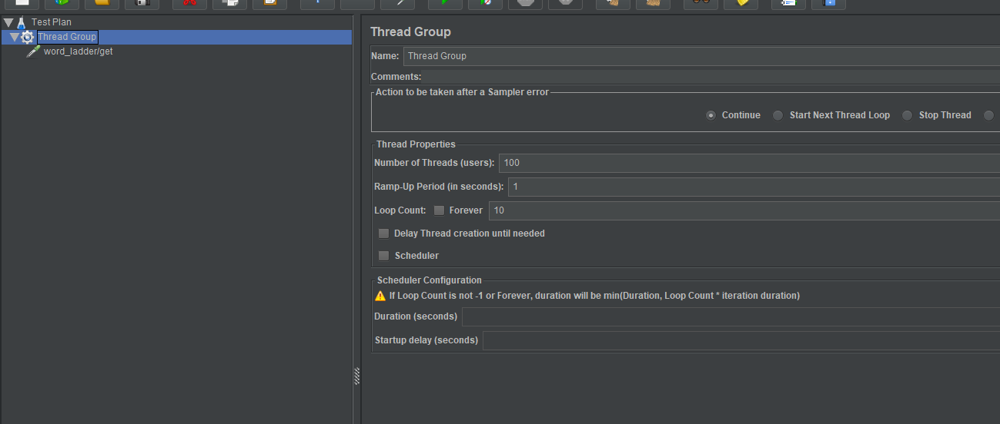
I set the Number ot Thread to 100 and loop for 10 times, and here are the performance result:
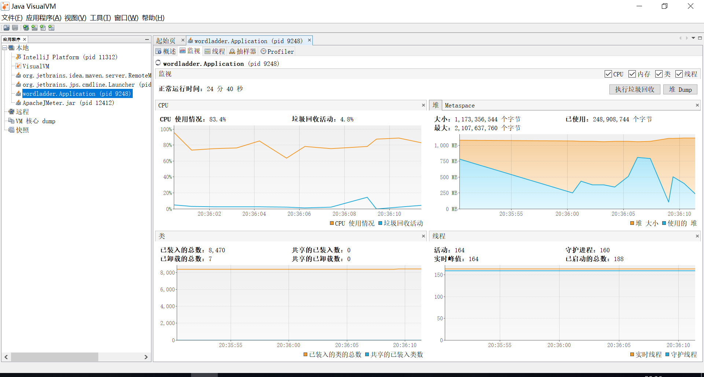
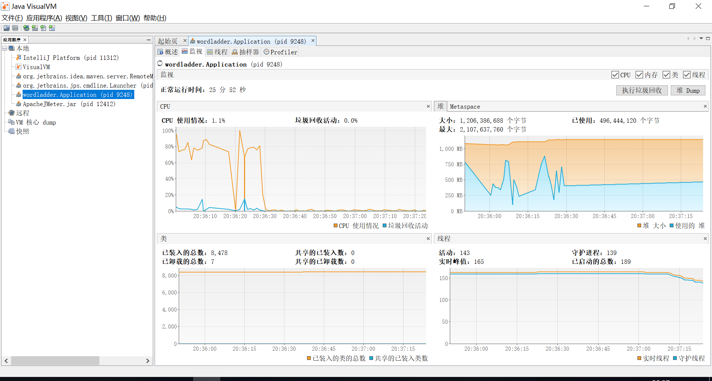
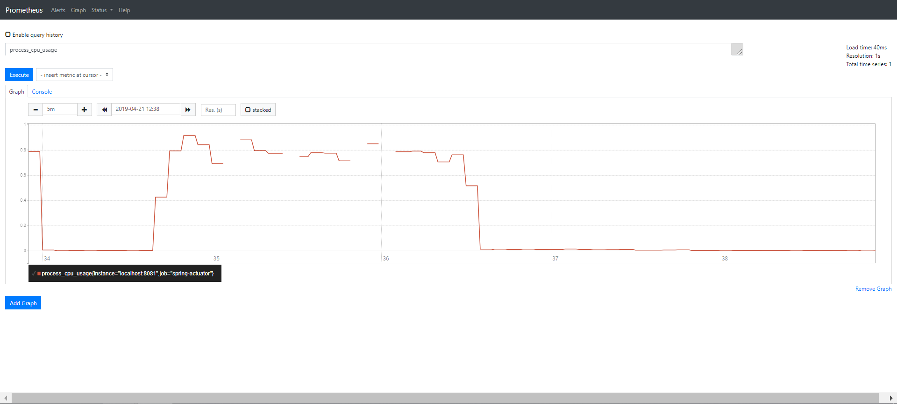
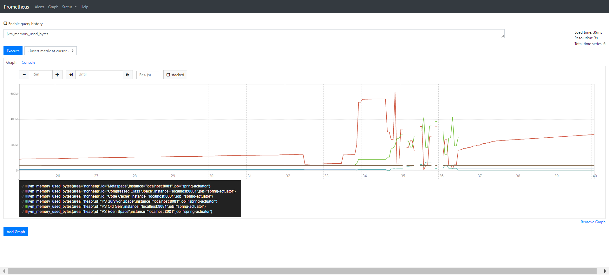
Clearly the comsuption is large. The CPU usage is nearly 100% and memory usage is up to about 750MB. The garbage collection works so the usage of memory is changing fast.

This time we made the number of thread smaller, which represents 30 user do get method for 5 times.
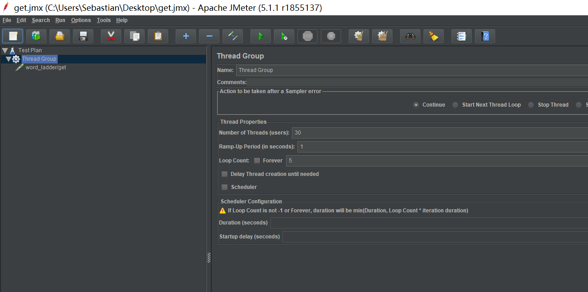
And here is the result:
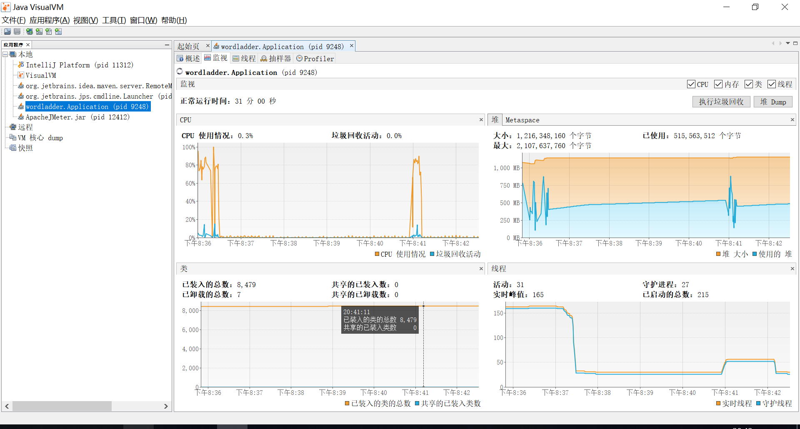
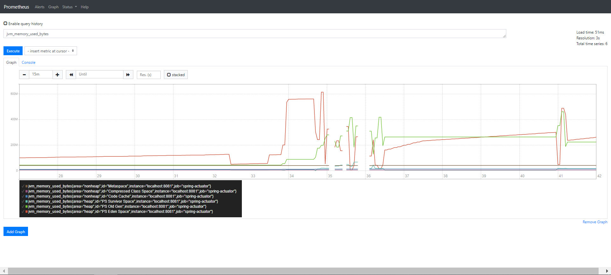
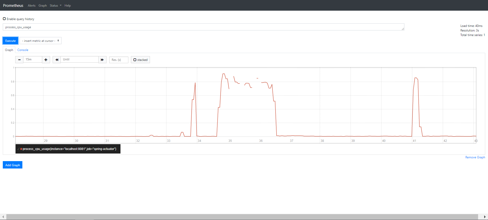
The CPU usage is still nearly 100%, and the memory usage is still up to 700MB, so this is still to heavy for the application and my laptop. But we can see the running time is much shorter due to less requests.

Lastly I tried a much smaller thread pool.
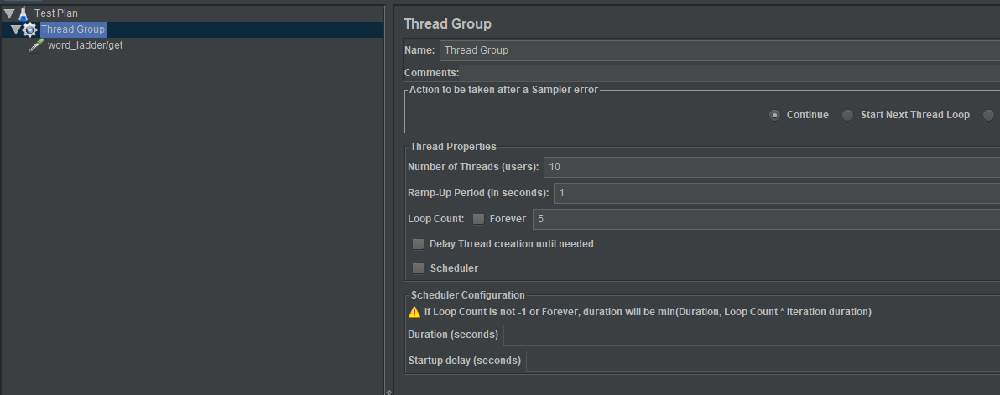
And here is the result:
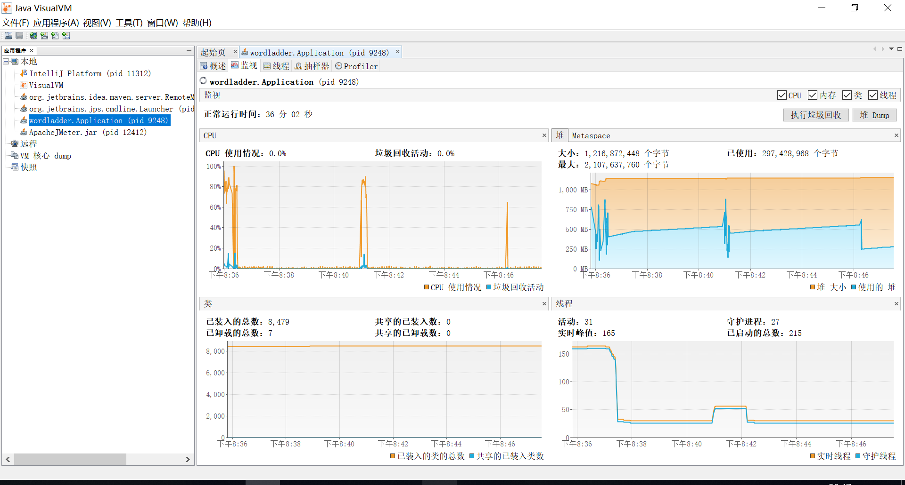
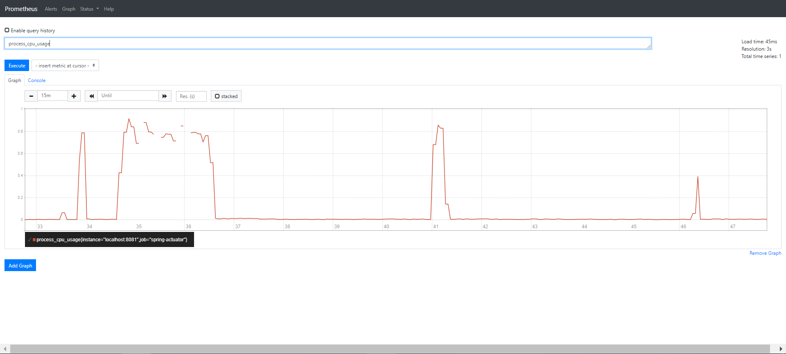
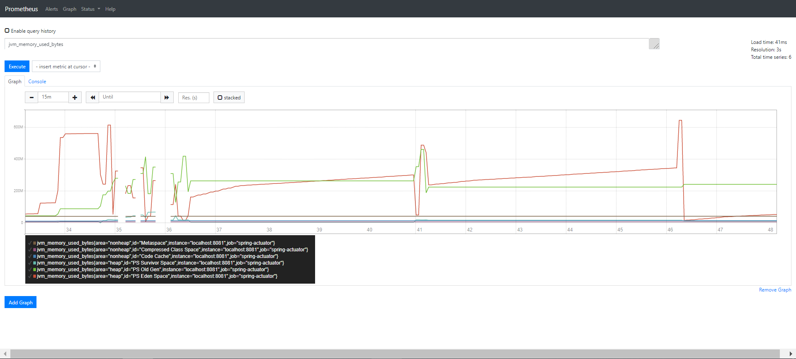
According to the charts, we can see the CPU usage is lower than 50%, the running time is very short and the memory usage is much lower.

By comparing three different situations, we can see that resource consumption is positively correlated with the number of requests and concurrency.

<span id = "anchor"></span>

## Dockerize    

I dockerized this application by build an image.

### How to use the image

I pushed it to the dockerhub, to use the image, do as follows.

1. Get the image by pull

```
docker pull sebastianj1w/wordladder-java:latest
```

2. Run the image 

```
docker run -d -p {port}:8081 sebastianj1w/wordladder-java
```

Then the containner will run at the background, to see status of it you can use `docker ps`

### Dockerfile

The Dockerfile to bulid this image is uploaded to `/Dockerized/Dockerfile`. Notes in the Dockerfile will describe every command's effect.

### Dockerhub

The dockerhub repo for TASK III is sebastianj1w/wordladder-java:
https://hub.docker.com/r/sebastianj1w/wordladder-java
