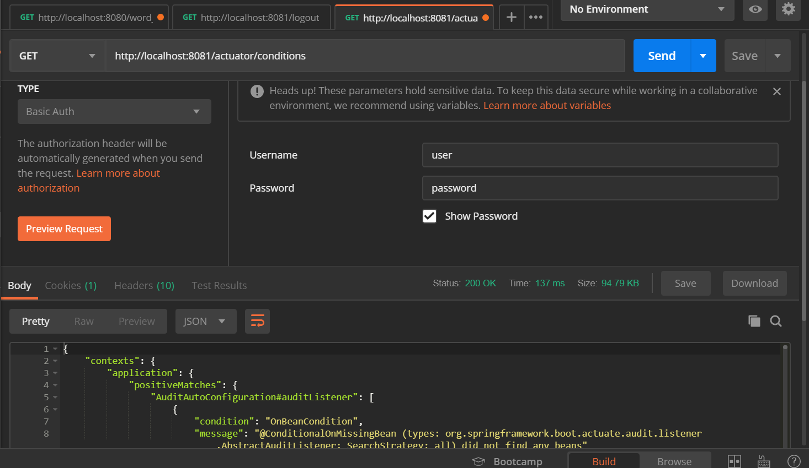

# WordLadder-RESTful

This repo is for HW3 of SE418, which is a converted version of WordLadder-JAVA

## Requirements

1. Convert HW1 of SE418 to a RESTful service, using Java, Unit test, Github and Maven/Gradle.

2. Phase I: Spring Boot / Git workflow

3. Phase II: Spring Actuator / *Spring Security

## Phase I

~~Now Phase I is under implementing, which is now store in branch `convert`.~~

Now the Phase I has been merged to master.

To run it, do as follows:

First, clone or download this repo:

```powershell
git clone https://github.com/sebastianj1w/WordLadder-RESTful.git
```

After clone or unzip, run the project by

```powershell
./mvnw spring-boot:run
```

## Phase II

### Spring actuator

Spring actuator adds several production grade services to the application with little effort on your part.

Now the Actuator has been added to the application.

By sending GET requests, we can get information abort the application:


### Spring security

Now the application is under the protection of Spring Security.

Firstly, we try to get a word ladder by GET, but **the request is denied**.


Then, we send a POST request containing login information. (note: To avoid CSRF issues, I disabled csrf protection)


After sending the login informations, try again to get a word ladder, and this time we succeded.


## Unit Test

~~Unit tests have been added to the `test` branch.~~

Now it has been merged into master, stored in `test` floder

